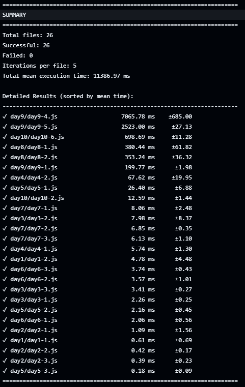

# Advent of Code 2025 — Solutions (Public)

This repository contains only the solution code (the `day*/` folders) from my Advent of Code 2025 workspace.

Why this repo exists

- My original workspace included private input files that the puzzle authors asked not to publish. This repo contains only the solution code — no input files.

## Notice!

I did use AI for some of my solutions, implmentation, and/or troubleshooting, all of the algorithms except one or two really complicated ones were entirely my own ideas and the others the AI helped me slighly not a complete shift from original vision of solve.

## Benchmark Results

I perfomred all of these benchmarks in GitHub actions and are by no means final or complete, but they do give you a good estimation of how efficient each algorithm or program is.

